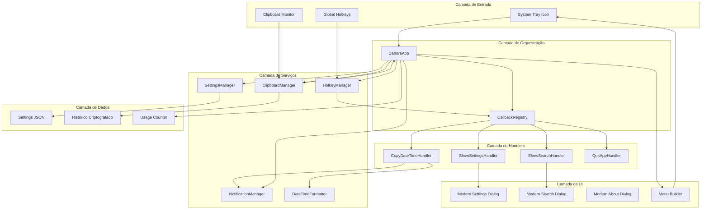
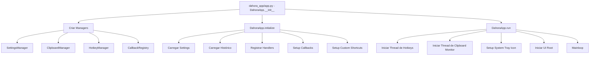
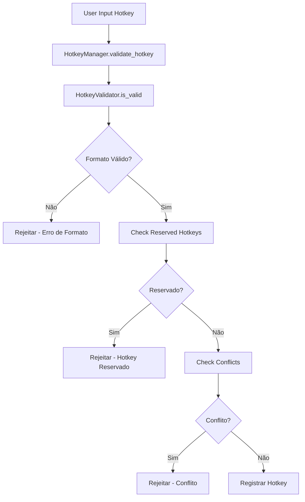
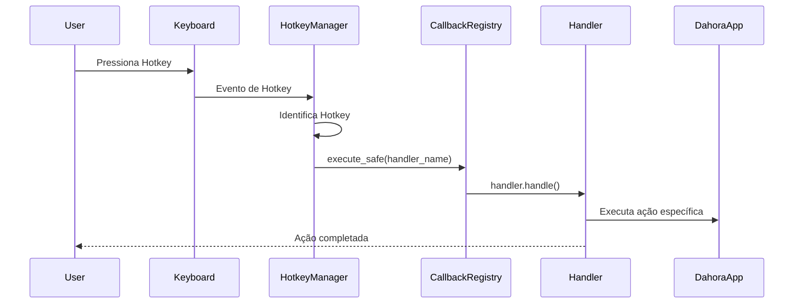
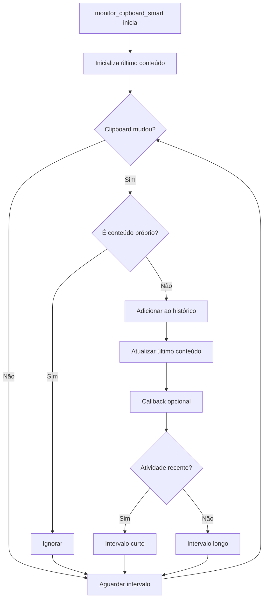

# Arquitetura da Dahora App

> Navegação: [Documentação](README.md) • [README do projeto](../README.md) • [CHANGELOG](../CHANGELOG.md)

Documentação detalhada sobre a estrutura, componentes e padrões de design utilizados no projeto.

## 1. Visão Geral

Dahora App é um aplicativo de gerenciamento de timestamps com clipboard e hotkeys globais. O projeto segue uma arquitetura modular com separação clara de responsabilidades entre componentes.

### Diagrama de Arquitetura de Componentes



### Estrutura de Diretórios

```
dahora_app/
├── __init__.py
├── callback_manager.py            # Orquestra callbacks/handlers
├── clipboard_manager.py           # Monitor de clipboard + histórico
├── constants.py                   # Constantes do projeto (APP_VERSION, paths)
├── counter.py                     # Contador de eventos
├── datetime_formatter.py          # Formatação de datas/horas
├── handlers/                      # Handlers para ações do app
│   ├── copy_datetime_handler.py
│   ├── quit_app_handler.py
│   ├── show_search_handler.py
│   └── show_settings_handler.py
├── hotkeys.py                     # Hotkeys globais
├── hotkey_validator.py            # Validação segura de hotkeys
├── notifications.py               # Notificações (Windows)
├── schemas.py                     # Schemas (validação) para settings/dados
├── settings.py                    # Configurações e persistência
├── single_instance.py             # Garantia de instância única (Windows)
├── thread_sync.py                 # Coordenação de threads / shutdown seguro
├── utils.py                       # Utilitários
└── ui/                            # Interface gráfica (diálogos/menu/estilos)
    ├── menu.py
    ├── modern_settings_dialog.py
    ├── modern_shortcut_editor.py
    ├── modern_search_dialog.py
    ├── modern_about_dialog.py
    ├── modern_styles.py
    └── icon_manager.py

tests/                             # Suíte de testes
├── conftest.py
├── test_*.py
└── README.md
```

## 2. Fluxo de Execução

### Inicialização da Aplicação



**Fluxo Textual:**
```
main.py
  └─> cria DahoraApp e chama run()

dahora_app/app.py
  ├─> carregar settings
  ├─> inicializar HotkeyManager
  ├─> configurar HotkeyValidator (centralizado)
  ├─> configurar monitoramento do clipboard
  ├─> aplicar hotkeys configuradas
  ├─> registrar custom shortcuts
  └─> exibir ícone no system tray
```

## 3. Componentes Principais

### 3.1 HotkeyManager (`hotkeys.py`)

**Responsabilidade:** Gerenciar hotkeys globais do sistema, incluindo hotkeys do app e custom shortcuts.

**Características:**
- Registra hotkeys via biblioteca `keyboard`
- Mantém lista de hotkeys reservados (clipboard + hotkeys do app) para evitar conflitos com atalhos personalizados
- Valida hotkeys usando `HotkeyValidator`
- Suporta callbacks por hotkey
- Thread-safe com RLock

**Métodos Principais:**
- `validate_hotkey(hotkey, exclude_shortcut_id)` - Valida usando HotkeyValidator
- `setup_custom_hotkeys(custom_shortcuts)` - Registra múltiplos atalhos
- `_register_custom_shortcut(shortcut_id, hotkey)` - Registra um atalho específico
- `set_custom_shortcut_callback(shortcut_id, callback)` - Define callback

**Fluxo de Validação:**


**Fluxo Textual:**
```
User hotkey input
  ├─> HotkeyManager.validate_hotkey()
  │   ├─> HotkeyValidator.is_valid()  <- Validação de formato
  │   ├─> Check reserved hotkeys
  │   └─> Check conflicts with other shortcuts
  └─> Register or reject
```

**Fluxo de Execução de Hotkey:**


### 3.2 HotkeyValidator (`hotkey_validator.py`) - NOVO

**Responsabilidade:** Validação segura e centralizada de hotkeys.

**Características:**
- Validação de formato (deve ter modificador + tecla)
- Bloqueio de teclas perigosas (Escape, Pause)
- Bloqueio de Ctrl+C por padrão (hotkey reservado)
- Suporte para símbolos (ex.: `exclam` → `!`, `at` → `@`, etc.)
- Normalização de hotkeys
- Mensagens de erro detalhadas

**API:**
- `HotkeyValidator` - Classe principal
  - `is_valid(hotkey, allow_reserved=False)` - Retorna bool
  - `validate_with_reason(hotkey, allow_reserved=False)` - Retorna (bool, str_razao)
  - `normalize(hotkey)` - Padroniza formato
  - `parse(hotkey)` - Analisa componentes

**Validações Realizadas:**
- ✓ Formato: `modifier+key` (ex: `ctrl+shift+a`)
- ✓ Bloqueio: Escape, Pause
- ✓ Símbolos: nomes e símbolos comuns (`exclam`, `at`, `!`, `@`, etc.)

### 3.3 SettingsManager (`settings.py`)

**Responsabilidade:** Carregar, validar e persistir configurações.

**Características:**
- Carregamento de arquivo JSON
- Validação com Pydantic `SettingsSchema` (única fonte de verdade)
- Se Pydantic falhar, retorna configurações padrão (sem fallback manual)
- Atomicidade em escrita (via `atomic_write_json`)
- Thread-safe

**Integração com Schemas:**
```
load()
  ├─> read settings.json
  ├─> validate_settings() (Pydantic)
  │   ├─> SettingsSchema validation
  │   └─> Se falhar: retorna defaults (sem fallback manual)
  └─> apply configuration
```

### 3.4 Pydantic Schemas (`schemas.py`) - NOVO

**Responsabilidade:** Definir estrutura e validações de dados de forma centralizada.

**Classes:**

#### CustomShortcutSchema
```python
id: int                    # >= 1, único
hotkey: str               # min 3, max 50 chars, deve ter '+'
prefix: str               # max 100, sanitizado
enabled: bool             # default True
description: str          # opcional, max 100
```

Validações:
- Hotkey format: deve conter '+' e formato válido
- Prefix sanitization: remove caracteres de controle
- Extra fields: rejeitados (extra='forbid')

#### SettingsSchema
```python
prefix: str               # max 100
hotkey_copy_datetime: str # padrão: ctrl+shift+q
hotkey_search_history: str # padrão: ctrl+shift+f
hotkey_refresh_menu: str   # padrão: ctrl+shift+r
max_history_items: int     # 10-1000, padrão: 100
clipboard_monitor_interval: float # 0.5-60s, padrão: 3
clipboard_idle_threshold: int # 5-300s, padrão: 30
datetime_format: str       # deve ter componente de data/hora
bracket_open: str          # 1 char, != bracket_close
bracket_close: str         # 1 char, != bracket_open
custom_shortcuts: List[CustomShortcutSchema]
default_shortcut_id: Optional[int] # existe em custom_shortcuts
notification_duration: int # 1-10s, padrão: 2
notification_enabled: bool # padrão: True
log_max_bytes: int         # 128KB-20MB, padrão: 1MB
log_backup_count: int      # 0-10, padrão: 1
ui_prewarm_delay_ms: int   # 0-10000ms, padrão: 700
tray_menu_cache_window_ms: int # 0-2000ms, padrão: 200
```

Validações:
- Brackets diferentes (open != close)
- Datetime format válido (tem %d, %m, %Y, %H, %M, ou %S)
- Prefix control chars removidos
- Custom shortcuts: IDs únicos e hotkeys não duplicadas
- Default shortcut ID existe
- Hotkeys duplicados detectados
- IDs únicos

#### NotificationSchema
```python
enabled: bool           # padrão: True
duration_seconds: int   # 1-10s, padrão: 2
show_on_error: bool     # padrão: True
```

#### AppConfigSchema
```python
settings: SettingsSchema
notifications: NotificationSchema
```

### 3.5 ClipboardManager (`clipboard_manager.py`)

**Responsabilidade:** Monitorar clipboard e gerenciar histórico.

**Características:**
- Monitora mudanças em clipboard (polling adaptativo)
- Armazena histórico criptografado no Windows (DPAPI)
- Ignora timestamps gerados pelo próprio app
- Suporta formatação customizável de timestamps
- Detecta inatividade para aplicar prefix
- **Otimização Futura:** Windows API Events (AddClipboardFormatListener) para reduzir CPU em idle

**Monitoramento Atual (Polling Adaptativo):**
- Polling baseado em intervalo configurável (`clipboard_monitor_interval`)
- Adapta intervalo baseado em atividade (reduz quando idle)
- Thread-safe com locks para histórico

**Fluxo de Monitoramento:**


### 3.6 Interface Gráfica (`ui/`)

**Componentes:**
- `menu.py` - Menu do system tray do Windows
- `modern_settings_dialog.py` - Diálogo de configurações (Pydantic-aware)
- `modern_shortcut_editor.py` - Editor de custom shortcuts (com HotkeyValidator)
- `modern_search_dialog.py` - Busca no histórico
- `modern_about_dialog.py` - Diálogo "Sobre" com informações do app
- `icon_manager.py` - Gerenciamento de ícones SVG
- `modern_styles.py` - Temas escuro/claro (CustomTkinter)

**UI Moderna (CustomTkinter):**
- Todas as janelas usam CustomTkinter para visual moderno
- Tema escuro/claro automático baseado no sistema
- Componentes responsivos e consistentes

### 3.7 Handlers e CallbackRegistry (`callback_manager.py`, `handlers/`)

**Responsabilidade:** Orquestrar callbacks e ações do aplicativo de forma desacoplada.

**Componentes:**

#### Protocols para Type Hints (adicionados em 12/01/2026)

8 Protocols definidos para type checking de callbacks:

| Protocol | Uso |
|----------|-----|
| `CopyDatetimeCallback` | Callback de copiar data/hora |
| `RefreshMenuCallback` | Callback de refresh do menu |
| `MenuItemCallback` | Callback de item de menu (pystray) |
| `SearchCallback` | Callback de busca |
| `SettingsSavedCallback` | Callback quando settings são salvos |
| `CopyFromHistoryCallback` | Callback de copiar do histórico |
| `NotificationCallback` | Callback de notificação |
| `GetHistoryCallback` | Callback de obter histórico |

Todos os Protocols são `@runtime_checkable` para validação em tempo de execução.

#### CallbackHandler (Abstract Base Class)
```python
class CallbackHandler(ABC):
    @abstractmethod
    def handle(self, *args, **kwargs) -> bool: ...
    @abstractmethod
    def get_name(self) -> str: ...
```

#### CallbackRegistry
Registry central para gerenciar handlers:
- `register(name, handler)` - Registra um handler
- `get(name)` - Obtém handler por nome
- `execute(name, *args)` - Executa handler
- `execute_safe(name, *args)` - Executa com thread-safety (usa ThreadSyncManager)
- `set_sync_manager(sync_manager)` - Injeta ThreadSyncManager

#### Handlers Implementados

| Handler | Responsabilidade |
|---------|-----------------|
| `CopyDateTimeHandler` | Copiar e colar timestamp formatado (com Ctrl+V automático) |
| `ShowSearchHandler` | Exibir diálogo de busca |
| `ShowSettingsHandler` | Exibir diálogo de configurações |
| `QuitAppHandler` | Encerrar aplicação de forma segura |

**Fluxo de Uso:**
```
Hotkey/Menu action
  ├─> DahoraApp._on_xxx_wrapper()
  │   ├─> callback_registry.get("handler_name")
  │   └─> handler.handle()
  └─> Handler executa ação específica
```

**Características:**
- Handlers recebem referência ao `DahoraApp` via `set_app()`
- Fallback para implementação legada se handler não disponível
- Thread-safety via `ThreadSyncManager`
- Type hints via Protocols para melhor validação estática

### 3.8 Otimizações de Performance

**UI Prewarm (`_prewarm_ui`):**
- Pré-constrói janelas CustomTkinter em idle (ocultas)
- Pode reduzir a latência percebida na primeira abertura (depende do ambiente)
- Registra tempos no log (ex.: `[UI] Prewarm ... fim em XXms`)
- Configurável via `ui_prewarm_delay_ms`

**Cache de Menu do Tray:**
- Evita reconstrução do menu em cliques rápidos
- Configurável via `tray_menu_cache_window_ms`
- Melhora responsividade do system tray

**UI Root Thread-Safety:**
- Lock (`threading.Lock`) protege inicialização do `_ui_root`
- Previne race conditions quando múltiplas threads acessam UI
- Implementado em `_ensure_ui_root()`

```python
def _ensure_ui_root(self):
    with self._ui_lock:  # Thread-safe
        if self._ui_root is None:
            self._ui_root = ctk.CTk()
            self._ui_root.withdraw()
```

**Preservação de Clipboard:**
- Timestamp é copiado, colado via Ctrl+V, e clipboard original restaurado
- Operação transparente para o usuário
- Implementado em `CopyDateTimeHandler`

## 4. Fluxo de Dados

### Carregamento de Configurações

```
Program Start
  ↓
SettingsManager.load()
  ├─ Read settings.json
  ├─ SettingsSchema.validate() (Pydantic)
  │  ├─ HotkeyValidator checks (via hotkeys.py)
  │  ├─ Bracket validation
  │  ├─ Custom shortcuts validation
  │  └─ Prefix sanitization
  ├─ Se falhar: retorna configurações padrão
  └─ Apply settings to UI components
```

### Validação de Hotkey (Novo)

```
User enters hotkey
  ↓
HotkeyManager.validate_hotkey()
  ├─ HotkeyValidator.is_valid()
  │  ├─ Check format (modifier+key)
  │  ├─ Check reserved keys
  │  ├─ Normalize and parse
  │  └─ Return bool
  ├─ Check system reserved hotkeys
  ├─ Check conflicts with custom shortcuts
  └─ Return (bool, error_message)
    ↓
If valid: Register hotkey with keyboard library
If invalid: Show error to user
```

### Salvamento de Configurações

```
User changes setting
  ↓
SettingsManager.update_all(settings_dict)
  ├─ Validate with SettingsSchema
  ├─ Apply to internal state
  └─ Save to settings.json (atomic)
    ↓
HotkeyManager updates hotkeys if needed
  ├─ Unregister old hotkeys
  └─ Register new hotkeys
```

## 5. Validação em Camadas

### Camada 1: Pydantic Schemas (Mais Rigorosa)

Validação estruturada e centralizada de todos os dados:
- Hotkey format validation
- Bracket pair validation
- Duplicate detection
- ID uniqueness
- Field constraints (min/max length, ranges)

**Quando usar:** Carregamento de arquivo, salvamento, importação de dados

### Camada 2: HotkeyValidator (Especializada)

Validação especializada apenas para hotkeys:
- Format parsing
- Symbol conversion
- Reserved key detection
- Human-friendly error messages

**Quando usar:** Qualquer entrada de hotkey (criar, editar, validar)

### Camada 3: HotkeyManager.validate_hotkey() (Integrada)

Combinação de HotkeyValidator + verificações de conflito:
- HotkeyValidator checks (formato)
- Reserved hotkeys checks (clipboard + hotkeys do app)
- Conflict detection (outros shortcuts)

**Quando usar:** Antes de registrar hotkey no sistema

## 6. Segurança

### Validações de Hotkey

- **Bloqueios Hard:** Escape, Pause (podem danificar sistema)
- **Reservados (atalhos personalizados):** Ctrl+C/V/X/A/Z e hotkeys do app (ex.: Ctrl+Shift+Q/F/R por padrão)
- **Formato Obrigatório:** Modifier + key (evita conflitos com texto)
- **Símbolos Suportados:** Conversão automática (exclam→!, etc)

### Validações de Configuração

- **Sanitização de Prefixo:** Remove caracteres de controle
- **Brackets Validados:** Não podem ser whitespace, devem ser diferentes
- **Limites Enforçados:** Max 1000 histórico, custom shortcuts sem limite fixo
- **Campos Extras:** Rejeitados pela Pydantic (extra='forbid')

### Tratamento de Erros

- Validação única com Pydantic (sem fallback manual)
- Logging detalhado de erros
- Recuperação graceful com defaults se validação falhar

## 7. Padrões de Design

### Singleton-like (com instância global)
```python
# No main.py
hotkey_manager = HotkeyManager()
settings_manager = SettingsManager()
```

### Validator Pattern
```python
validator = HotkeyValidator()
is_valid, reason = validator.validate_with_reason(hotkey)
```

### Pydantic Models (Data Validation)
```python
try:
    schema = SettingsSchema(**raw_data)
except ValidationError as e:
    handle_error(e)
```

### Validação Única (Pydantic)
```python
try:
    validated = SettingsSchema(**data)
except ValidationError:
    # Retorna configurações padrão (sem fallback manual)
    return get_default_settings()
```

## 8. Tratamento de Erros

### Contexto: Validação Pydantic

```python
from pydantic import ValidationError
from dahora_app.schemas import SettingsSchema

try:
    schema = SettingsSchema(**settings_dict)
except ValidationError as e:
    for error in e.errors():
        field = error['loc'][0]
        msg = error['msg']
        logging.error(f"Campo '{field}': {msg}")
    # Retorna configurações padrão (sem fallback manual)
    logging.warning("Validação Pydantic falhou, usando defaults")
    return get_default_settings()
```

### Contexto: Validação de Hotkey

```python
valid, reason = hotkey_manager.validate_hotkey(hotkey)
if not valid:
    show_error(f"Hotkey inválido: {reason}")
    # reason pode ser:
    # - "Hotkey não pode ser vazio"
    # - "Hotkey deve ter pelo menos um '+' (ex: ctrl+shift+q)"
    # - "Hotkey 'ctrl+c' é reservado pelo sistema"
    # - "Hotkey 'ctrl+shift+q' já está em uso por outro atalho"
```

## 9. Testes

### Suite de Testes Total: 267+ testes

#### Handlers (35 testes) - `test_handlers.py`
- QuitAppHandler (9 testes)
- CopyDateTimeHandler (8 testes)
- ShowSettingsHandler (8 testes)
- ShowSearchHandler (8 testes)
- Integração de Handlers (2 testes)

#### HotkeyValidator (37 testes) - `test_hotkey_validator.py`
- Normalização (10 testes)
- Parsing (8 testes)
- Validação (7 testes)
- Sugestões (3 testes)
- Símbolos (4 testes)
- Edge cases (5 testes)

#### Schemas (29 testes) - `test_schemas.py`
- CustomShortcutSchema (8 testes)
- SettingsSchema (16 testes)
- NotificationSchema (2 testes)
- AppConfigSchema (3 testes)

#### Outros Testes (166 testes)
- Custom shortcuts (22 testes)
- Datetime formatter (12 testes)
- Hotkey manager (21 testes)
- Settings (10 testes)
- Thread sync (28 testes)
- Single instance (23 testes)
- Outros componentes (50+ testes)

### Executar Testes

```bash
# Todos os testes
py -m pytest

# Testes específicos
py -m pytest tests/test_hotkey_validator.py -v
py -m pytest tests/test_schemas.py -v

# Com coverage
py -m pytest --cov=dahora_app tests/
```

## 10. Dependências Adicionadas

### Pydantic v2.0+
```
py -m pip install pydantic>=2.0
```

**Uso:**
- Validação estruturada de dados
- Type hints com validação automática
- Mensagens de erro detalhadas
- Serialização/deserialização automática

## 11. Backward Compatibility

### Mantida 100%

- Validação única com Pydantic (sem fallback manual)
- Se validação falhar, retorna configurações padrão
- Novos módulos não modificam código existente
- HotkeyValidator integrado sem quebrar validação existente
- Schemas usam os mesmos campos que settings.py

### Migração de Dados

Settings antigos são automaticamente validados e convertidos:
```python
# Arquivo settings.json antigo
{"prefix": "old_prefix", ...}
  ↓
Carregado por SettingsSchema (com sanitização)
  ↓
Validado e aplicado
```

## 12. Fluxo de Desenvolvimento Futuro

### Próximas Etapas Sugeridas

1. **Integração de APIs:** Usar schemas para validar dados de APIs externas
2. **Testes de Integração:** UI + Schemas + HotkeyValidator
3. **Documentação de HACKs:** Identificar e documentar workarounds
4. **Performance:** Caching de validação, otimização de clipboard monitor
5. **Testes de Estresse:** Validar com 100+ custom shortcuts

## 13. Guia de Manutenção

### Adicionar Novo Hotkey Validável

1. Editar `HotkeyValidator` se necessário
2. Editar `SettingsSchema` para novo campo
3. Editar `SettingsManager` para carregar novo campo
4. Editar `HotkeyManager` para usar novo hotkey
5. Adicionar testes em `test_schemas.py` e `test_hotkey_validator.py`

### Alterar Regras de Validação

1. Editar `SettingsSchema` ou `HotkeyValidator`
2. Atualizar testes correspondentes
3. Rodar full test suite: `pytest`
4. Verificar backward compatibility

### Adicionar Nova Configuração

1. Definir em `SettingsSchema`
2. Adicionar validação customizada se necessário
3. Atualizar `SettingsManager`
4. Atualizar UI
5. Adicionar testes

## 14. Referências

- [Pydantic Documentation](https://docs.pydantic.dev/)
- [Keyboard Library](https://github.com/boppreh/keyboard)
- [Python Type Hints](https://docs.python.org/3/library/typing.html)
- [Git Flow](https://www.atlassian.com/git/tutorials/comparing-workflows/gitflow-workflow)

---

**Última Atualização:** 13 de janeiro de 2026
**Versão da Documentação:** 1.2
**Status:** Completa e em produção

### Changelog da Documentação

**v1.2 (13/01/2026):**
- Adicionados diagramas visuais em Mermaid:
  - Diagrama de arquitetura de componentes (seção 1)
  - Diagrama de fluxo de inicialização (seção 2)
  - Diagrama de validação de hotkey (seção 3.1)
  - Diagrama de sequência de execução de hotkey (seção 3.1)
  - Diagrama de monitoramento de clipboard (seção 3.5)

**v1.1 (12/01/2026):**
- Adicionada seção 3.7: Handlers e CallbackRegistry
- Adicionada seção 3.8: Otimizações de Performance
- Atualizado total de testes (267+)
- Documentados handlers: CopyDateTimeHandler, ShowSearchHandler, ShowSettingsHandler, QuitAppHandler
- Documentadas otimizações: UI Prewarm, Cache de Menu, Thread-Safety

**v1.0 (06/01/2026):**
- Versão inicial da documentação de arquitetura
